# 🍣 Danny's Diner — Case Study #1 | 8 Week SQL Challenge

Solução em SQL para o **Case Study #1 - Danny's Diner**, parte do [8 Week SQL Challenge](https://8weeksqlchallenge.com/case-study-1/), criado por Danny Ma.

> 🔗 Case study original: [https://8weeksqlchallenge.com/case-study-1/](https://8weeksqlchallenge.com/case-study-1/)

## 📖 Sobre o desafio

Danny abriu um pequeno restaurante japonês no início de 2021, vendendo seus três pratos favoritos: **sushi**, **curry** e **ramen**. Ele capturou dados básicos de operação dos primeiros meses do restaurante, mas precisa de ajuda para transformá-los em informações úteis sobre:

- Padrões de visita dos clientes;
- Quanto dinheiro cada cliente gastou;
- Quais itens do cardápio são os favoritos de cada um.

O objetivo é usar essas informações para ajudar Danny a decidir se vale a pena expandir o programa de fidelidade (loyalty program) já existente.

## 🗂️ Dados

O conjunto de dados é composto por três tabelas, originalmente pertencentes ao schema `dannys_diner`:

| Tabela | Descrição |
|---|---|
| `sales` | Registra as compras de cada cliente (`customer_id`), com a data do pedido (`order_date`) e o item comprado (`product_id`). |
| `menu` | Relaciona o `product_id` ao nome do produto (`product_name`) e seu preço (`price`). |
| `members` | Contém a data (`join_date`) em que cada cliente aderiu ao programa de fidelidade. |

Neste projeto, os dados são carregados a partir de arquivos `.csv` (pasta `./data`) e transformados em um banco **SQLite** (`data.db`) por meio do script `main.py`.

## 🛠️ Tecnologias utilizadas

- **Python 3** — carga dos dados (ETL simples)
- **pandas** — leitura dos arquivos CSV
- **SQLAlchemy** — conexão e escrita no banco de dados
- **SQLite** — banco de dados usado para rodar as consultas
- **SQL** — resolução das perguntas do case study

## 📁 Estrutura do projeto

```
.
├── main.py             # Script que lê os CSVs e cria o banco data.db (SQLite)
├── data/               # Arquivos .csv de origem (sales, menu, members)
├── data.db             # Banco de dados SQLite gerado a partir dos CSVs
├── images/             # Prints do resultado de cada query
│   ├── 01.sql.png
│   ├── 02.sql.png
│   ├── ...
│   ├── bonus01.sql.png
│   └── bonus02.sql.png
├── sql/                # Consultas SQL, uma por pergunta
│   ├── 01.sql
│   ├── 02.sql
│   ├── ...
│   ├── bonus01.sql
│   └── bonus02.sql
└── README.md
```

## ▶️ Como executar

1. Certifique-se de ter os arquivos `sales.csv`, `menu.csv` e `members.csv` dentro da pasta `./data`.
2. Instale as dependências:

   ```bash
   pip install pandas sqlalchemy
   ```

3. Execute o script para gerar o banco `data.db`:

   ```bash
   python main.py
   ```

4. Rode os arquivos `.sql` no banco `data.db` usando sua ferramenta preferida (ex: [DB Browser for SQLite](https://sqlitebrowser.org/), extensão SQLite do VS Code, ou `sqlite3` via terminal):

   ```bash
   sqlite3 data.db < sql/01.sql
   ```

## ❓ Perguntas respondidas

### Perguntas principais

#### 1. Qual o valor total gasto por cada cliente no restaurante?
[`sql/01.sql`](sql/01.sql)

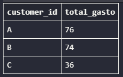

#### 2. Há quantos dias cada cliente visita o restaurante?
[`sql/02.sql`](sql/02.sql)

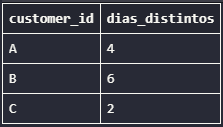

#### 3. Qual foi o primeiro item do menu comprado por cada cliente?
[`sql/03.sql`](sql/03.sql)

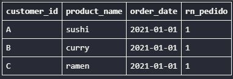

#### 4. Qual é o item mais pedido do cardápio e quantas vezes ele foi comprado por todos os clientes?
[`sql/04.sql`](sql/04.sql)

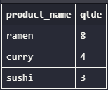

#### 5. Qual foi o item mais popular entre cada cliente?
[`sql/05.sql`](sql/05.sql)

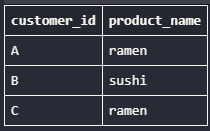

#### 6. Qual foi o primeiro item comprado pelo cliente após ele se tornar membro?
[`sql/06.sql`](sql/06.sql)

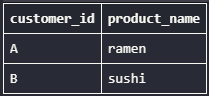

#### 7. Qual item foi comprado imediatamente antes do cliente se tornar membro?
[`sql/07.sql`](sql/07.sql)

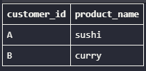

#### 8. Qual o total de itens e o valor gasto por cada membro antes de se tornar membro?
[`sql/08.sql`](sql/08.sql)

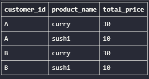

#### 9. Se cada dólar gasto equivale a 10 pontos e o sushi tem multiplicador 2x, quantos pontos cada cliente teria?
[`sql/09.sql`](sql/09.sql)

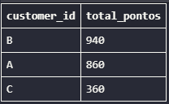

#### 10. Considerando o dobro de pontos na primeira semana após a adesão, quantos pontos os clientes A e B têm no final de janeiro?
[`sql/10.sql`](sql/10.sql)

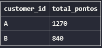

### Perguntas bônus

#### Join All The Things
Recriar uma tabela unindo `sales`, `menu` e `members`, indicando se a compra foi feita como membro (`Y`/`N`).
[`sql/bonus01.sql`](sql/bonus01.sql)

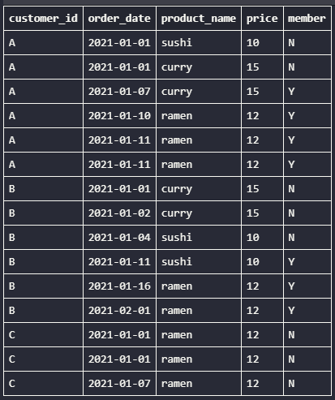

#### Rank All The Things
A partir da tabela acima, adicionar um ranking dos pedidos feitos apenas após o cliente se tornar membro (pedidos como não membro recebem `ranking` nulo).
[`sql/bonus02.sql`](sql/bonus02.sql)

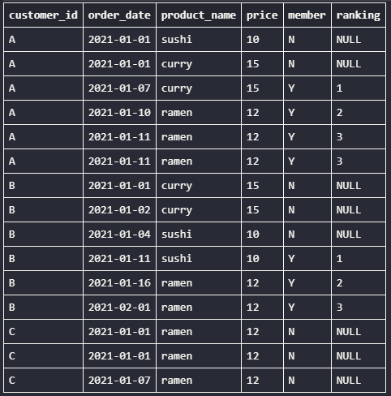

## 🧠 Conceitos de SQL praticados

- `JOIN` (principalmente `LEFT JOIN`) entre múltiplas tabelas
- `GROUP BY` e funções agregadas (`SUM`, `COUNT`)
- CTEs (`WITH`)
- Funções de janela (`ROW_NUMBER`, `RANK`) com `PARTITION BY`
- `CASE WHEN` para lógica condicional
- Manipulação de datas (`julianday`, comparações entre datas)

## 📌 Créditos

Case study idealizado por **Danny Ma** como parte do [8 Week SQL Challenge](https://8weeksqlchallenge.com/). Todos os direitos sobre o enunciado e os dados pertencem ao autor original — este repositório contém apenas a resolução das questões propostas.